<p align="center">
  <a href="https://github.com/Harmann60">
    
  </a>
</p>


<p align="center">

  

</p>

---


## `~/` whoami

```console
$ cat about.txt
```

Hi, I'm **Harman Jassal**. I'm a Computer Science student who enjoys building things
for the web, solving problems with C++, and figuring out why something broke at 2 AM.

- Currently building tourism website about **[Kalpa](https://github.com/Harmann60/Kalpa)**
- Learning **GSAP + Lenis**
- Reach me at harmanjss10@gmail.com
- Fun fact: **Mountains keep me grounded, and I admire Heung-Min Son for his grace under pressure.**

<br>

<div align="center">


---


## `~/` toolbox

<p align="center">

  

</p>


---


<div align="center">

## `~/` skill radar

<table>
<tr>
<td width="50%" align="center" valign="middle">

<!-- Self-rated radar - edit assets/skills.json, the workflow redraws it -->
<picture>
  <source media="(prefers-color-scheme: dark)"  srcset="assets/radar-dark.svg">
  <source media="(prefers-color-scheme: light)" srcset="assets/radar-light.svg">
  
</picture>

</td>
<td width="50%" align="center" valign="middle">

<!-- Live radar built from real language byte counts across your repos -->
<picture>
  <source media="(prefers-color-scheme: dark)"  srcset="assets/radar-langs-dark.svg">
  <source media="(prefers-color-scheme: light)" srcset="assets/radar-langs-light.svg">
  
</picture>

</td>
</tr>
</table>

</div>


---

<div align="center">

## `~/` contribution calendar

<!-- 3D isometric calendar, regenerated every 6h by .github/workflows/metrics.yml -->


<br><br>

<!-- Snake eats the contribution graph - .github/workflows/snake.yml -->
<picture>
  <source media="(prefers-color-scheme: dark)"  srcset="https://raw.githubusercontent.com/harmann60/harmann60/output/snake-dark.svg">
  <source media="(prefers-color-scheme: light)" srcset="https://raw.githubusercontent.com/harmann60/harmann60/output/snake.svg">
  
</picture>

</div>

---


<p align="center">
  <i>“Code like mountains — strong, grounded, and reaching new heights.”</i> 🌄
</p>

<p align="center">
  
</p>
